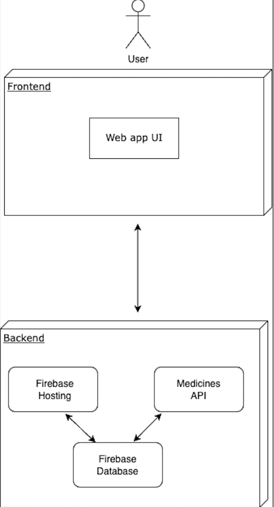
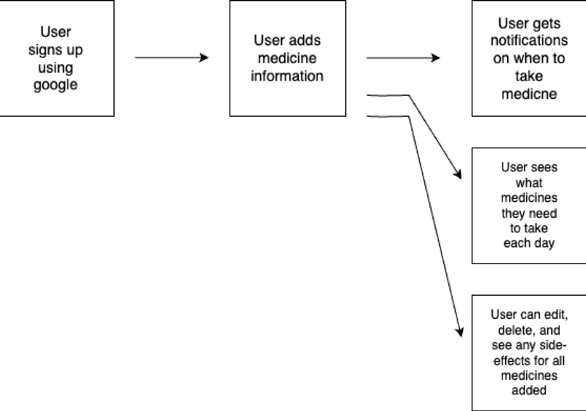

# Overview
## High-level system architecture overview diagram:

1. The User interacts with the web-app UI
2. The app is hosted on Firebase hosting service
3. The Firebase database stores the user's information
5. The medicine API sends medicine information to the database.

## More detailed information:
Our web-app UI uses React, and is hosted using the Firebase hosting service. The user logs in using Google aunthentication and the information is stored in the real-time Firebase database. When the user adds in medicine information, the information is sent to the database and the medicine name is queried and the medicine API is called. This returns the medicine side-effects to the app.

# Design Process Documentation:
* Date: 1/12: Decided that Medminder would be a Webapp and decided to use React for the frontend
* Date: 1/26: Decided to use Firebase database for backend
* Date: 2/2: Worked on breaking the app down into pages and planning the design
* Date: lecture 5: Designed medicine pop up
* Date: Lecture 7: Designed home page, used color palette 
* Date: Lecture 8: Dashboard styling (made it very simple to bring attention to the date and medicine info)
* Date: Lab06: Worked on responsive UI to screen changes
* Date: lect11: Remodeled pop up to make it simpler
* Date: lect12: Working on making UI more elder-friendly

# User flow

